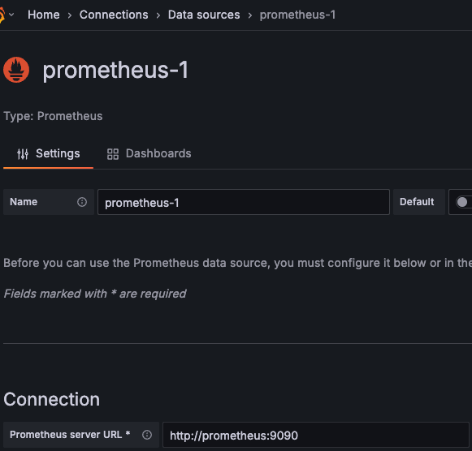

# Read Me First
The following was discovered as part of building this project:

* The original package name 'dev.annopud.prometheus-metrics' is invalid and this project uses 'dev.annopud.prometheus_metrics' instead.

# Getting Started

### Reference Documentation
For further reference, please consider the following sections:

* [Official Apache Maven documentation](https://maven.apache.org/guides/index.html)
* [Spring Boot Maven Plugin Reference Guide](https://docs.spring.io/spring-boot/3.5.3/maven-plugin)
* [Create an OCI image](https://docs.spring.io/spring-boot/3.5.3/maven-plugin/build-image.html)
* [Prometheus](https://docs.spring.io/spring-boot/3.5.3/reference/actuator/metrics.html#actuator.metrics.export.prometheus)
* [Spring Web](https://docs.spring.io/spring-boot/3.5.3/reference/web/servlet.html)
* [Monitoring Made Simple: Empowering Spring Boot Applications with Prometheus and Grafana](https://medium.com/simform-engineering/revolutionize-monitoring-empowering-spring-boot-applications-with-prometheus-and-grafana-e99c5c7248cf)

### Guides
The following guides illustrate how to use actuator metrics and integration with Prometheus and Grafana:

Start up prometheus and grafana using docker-compose:
```Bash
docker-compose up
```

Verify that the Prometheus server is running by visiting [http://localhost:9090](http://localhost:9090).

Verify that the Grafana server is running by visiting [http://localhost:3000](http://localhost:3000).
enter the default credentials `admin` for both username and password.

## Creating a Prometheus Datasource in Grafana
see if datasource exists, if not add a new datasource with the following settings:



then click on the `Save & Test` button to verify the connection.

## Importing a Dashboard in Grafana
To import a dashboard, click on the `+` icon in the left sidebar and select `Import`.
enter the dashboard ID `11378` or the URL [https://grafana.com/grafana/dashboards/11378-justai-system-monitor/](https://grafana.com/grafana/dashboards/11378-justai-system-monitor/)
and click on the `Load` button.
Select the Prometheus datasource you created earlier and click on the `Import` button.

